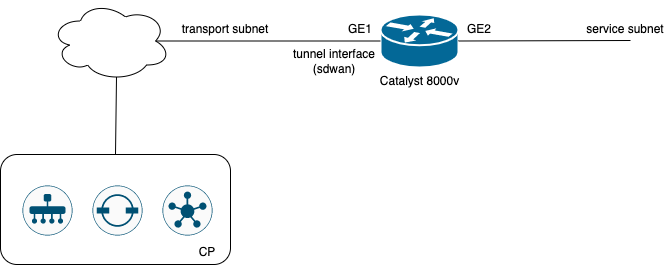

# Catalyst 8000v deployment on VMWare vSphere

Deployment of the c8kv on vSphere with basic onfiguration and onboarding in the SDWAN CP

The scripts will deploy and onboard a Catalyst 8000V on vSphere using existing networks. Following items will be created:

- Single C8000v instance with a transport interface and a service interface. Basic configuration to connect to an existing SD-WAN Fabric.

The scripts will create a new c8kv instance from an existing template. Creating the template from the Catalyst 8000v ISO image can be done using the provided packer script.

## Create the template using packer

Using the [vsphere-iso builder](https://developer.hashicorp.com/packer/plugins/builders/vsphere/vsphere-iso) of the [vSphere packer plugin](https://github.com/hashicorp/packer-plugin-vsphere) the scripts will create a template based on the c8kv iso image.

- Go to image directory
- Edit variables.json with appropriate settings.

The iso_url can be a local file or a remote URL.

With image as your current working directory, run packer:

    packer build -var-file ./variables.json .

> **NOTE:**  The way C8Kv images are converted into templates requires a full boot of the initial VM with the ISO attached, which will format the hard drive and transfer some initial data, after which it will reboot. However, the VM should not be allowed to boot a second time after this initialization, as it will lose its capacity to be configured through cloud-init. The process to prevent this and shut down the VM when appropriate is not yet fully automated, as the VM reboot moment cannot be detected. What the Packer script does currently is to wait 42 seconds after VM boot, which is the time to complete the first phase of hard drive formatting and reboot on a current UCS based vSphere environment, but may obviously not work in all cases. After the first phase the VM will reboot and present a Grub menu with a 5 second timeout. The Packer script targets this menu with the 42 seconds wait time, and then moves the cursor down one item, to stop the 5 second timeout counter of the Grub menu. By using the "none" communicator of the Packer vSphere provider, the CLI will show a request for a manual shutdown of the VM within 5 minutes, before it is transformed into a template. It is a good idea no to rely on the 42 seconds wait time and monitor the console of the VM during the boot process to power it off manually as soon as the Grub menu is presented.

## Create c8000v in vSphere

The 2 needed networks - transport and service - are expected to already exist. Also be sure to have the necessary cloud-init file under the cloud-init directory - use the provided ansible script under GenerateCloudInit to generate it.

Deploy Cisco SD-WAN C8000v in the VPC network:

- Go to cedge directory
- Edit variables.auto.tfvars.json with appropriate settings.

The complete list of input variables:

- name: name of the deployed instance
- vsphere_server: hostname of the vSphere server
- vsphere_user: vSphere username
- vsphere_password: vSphere password
- datacenter: datacenter to use
- cluser
- datastore
- folder - folder where to create the instance (can be empty)
- template - name of the c8kv template
- vm_num_cpus - number of vcpus for the created instance
- vm_memory - amount of memory for the created instance
- subnet_transport - name of the subnet to be used for the transport interface
- subnet_service: name of the subnet to be used for the service interface

Terraform deployment:

    terraform init
    terraform plan
    terraform apply

## Termination

To terminate c8000v instances, go to the cedge directory and run:

    terraform destroy --auto-approve
